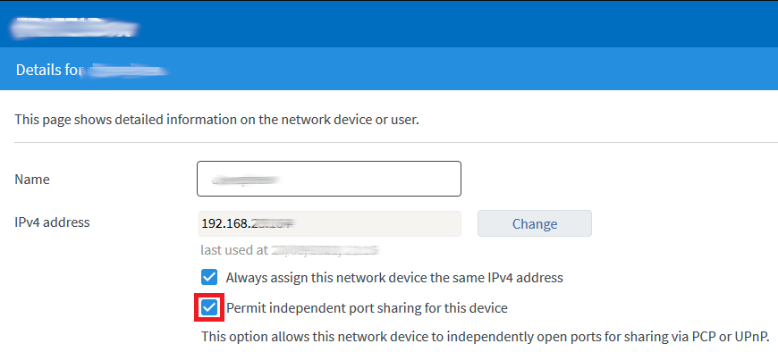
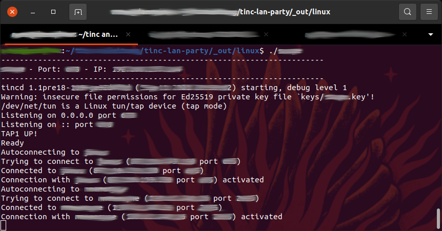

% Tinc-VPN LAN party notes

## Build tinc from git

Install packages (Ubuntu 20.04):

```
sudo apt install git build-essential autoconf texinfo \
    zlib1g-dev liblzo2-dev libssl-dev libncurses-dev \
    libreadline-dev libminiupnpc-dev
```

Build and install:

```
git clone https://github.com/gsliepen/tinc.git
cd tinc
autoreconf -fsi
./configure --disable-legacy-protocol --enable-miniupnpc
make
sudo make install-strip
```

## Set needed capabilities

If you used port numbers bigger than 1024 then you don't need CAP_NET_BIND_SERVICE.
CAP_SYS_NICE is good for lower latency but isn't needed if `ProcessPriority = high` is disabled from "tinc.conf".

```
sudo setcap cap_net_bind_service,cap_sys_nice+ep /usr/local/sbin/tincd
```

# Firewall

If you want to host game sessions it is advised to allow tinc to forward its UDP/TCP port at your internet access.
You'll have to use the same port number (forwarding from another port won't work).
The more nodes reachable externally via tinc port the better.

The easiest way to do this is allow your PC to configure the firewall on your internet router via UPnP. For example:



# Running the node scripts

At the first run the **__TAP_ADAPTER_NAME__** device will be created for your user
(it can be removed by calling `tincvpn/remove-TAP`). Your user needs to be able to
execute commands as super user with sudo because otherwise the tap adapter can
neither be created nor configured (I haven't found a way to simplify this).

run the script with <code>./<b>nodename</b></code>:


