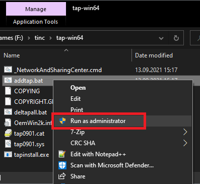
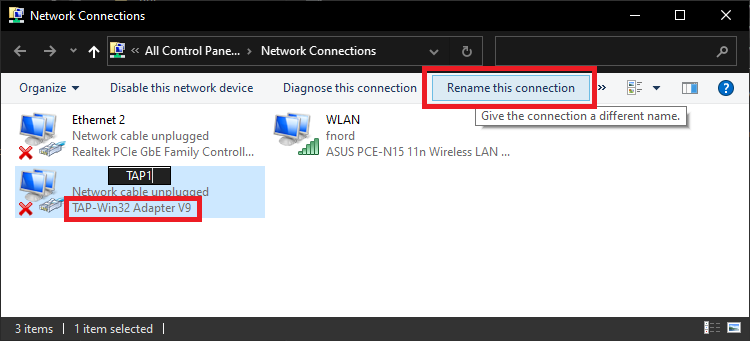
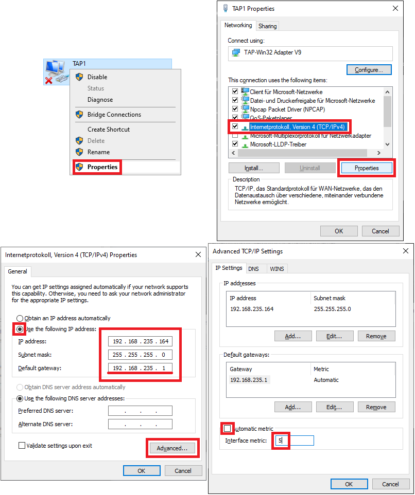
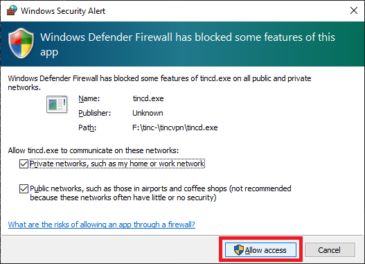
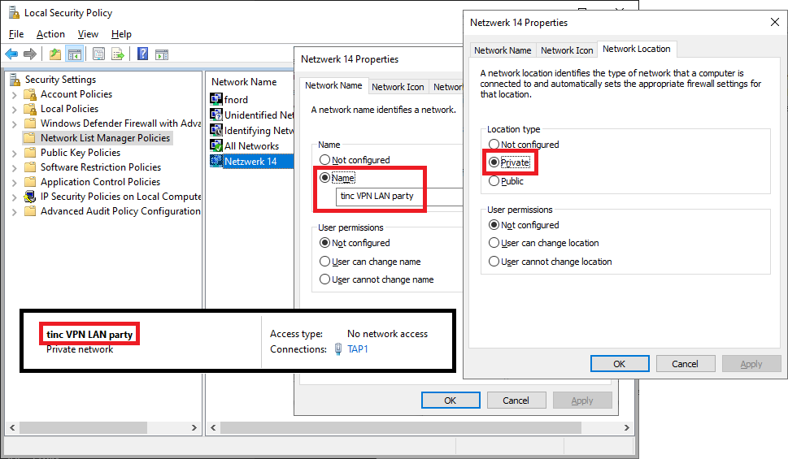
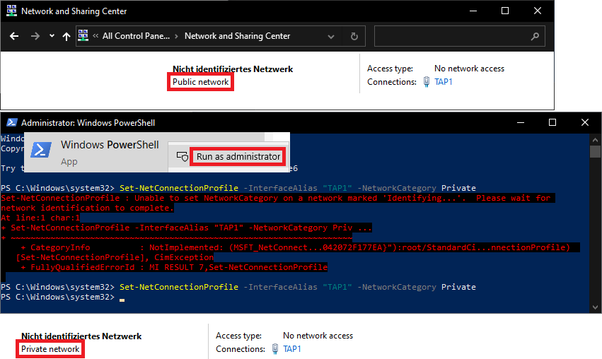
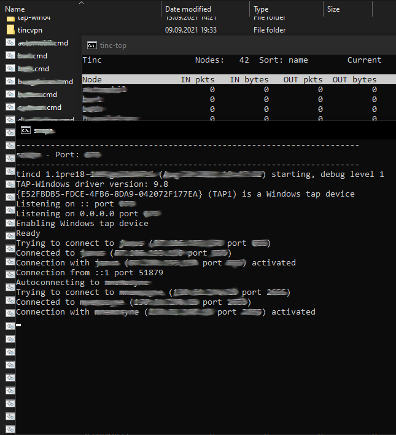

% Tinc-VPN LAN party notes

## Install TAP adapter

If you don't happen to have a TAP adapter by OpenVPN you'll need to install one.
Change to the "tap-win64" folder and right click on "addtap.bat" then click "Run as administrator".



Click on "_netconnections.cmd" or run `control netconnections` to open "Network Connections".
You'll need to rename the "TAP-Win32 Adapter V9" to **__TAP_ADAPTER_NAME__**.



## Change IPv4 settings

Enter the IPv4 properties for network **__VPN_NETWORK__.0/24** (last octet will also be set by 
"node.cmd" script if invoked as administrator).
It is important to set a default gateway even if it won't act as one because
Windows won't apply correct firewall policies otherwise. As long as __VPN_NETWORK__.**1** retains it's
MAC address Windows will also remember the networks settings.
Manually setting a low metric (f. ex. 5) is needed for some games.



## Change network settings

We need to set the VPN LAN as private network to be able to host game sessions
(without completely disabling the firwall).
Start up one of the "node.cmd" scripts and you'll be asked to allow tincd.exe to open a TCP/UDP port.



Click on "_network_and_sharing_center.cmd" or run `control /name Microsoft.NetworkAndSharingCenter`.
You'll notice a new "unidentified" Network connected to **__TAP_ADAPTER_NAME__** and being
labeled as "Public network". We'll need to change it to "Private network".

### Win10 Professional

Run `secpol.msc` and find the network in the "Network List Manager Policies".
Change the "Network Location type" to "Private". You can optionally set a "Network Name".



### Win10 Home

Run "Windows Powershell" as administrator and enter:
```
Set-NetConnectionProfile -InterfaceAlias "__TAP_ADAPTER_NAME__" -NetworkCategory Private
```
Now the network should read "Private network". 
Sadly it is only possible to set the network's name by editing the registry.



# Firewall

If you want to host game sessions it is advised to allow tinc to forward its UDP/TCP port at your internet access.
You'll have to use the same port number (forwarding from another port won't work).
The more nodes reachable externally via tinc port the better.

The easiest way to do this is allow your PC to configure the firewall on your internet router via UPnP. For example:


# Running the node scripts

Double-click "nodename.cmd". The "tinc-top" window can be closed, the "node" window needs to stay open during
the gaming session.

